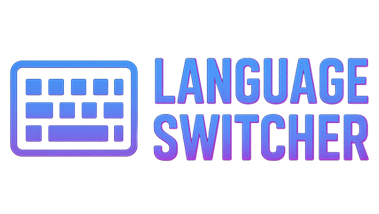
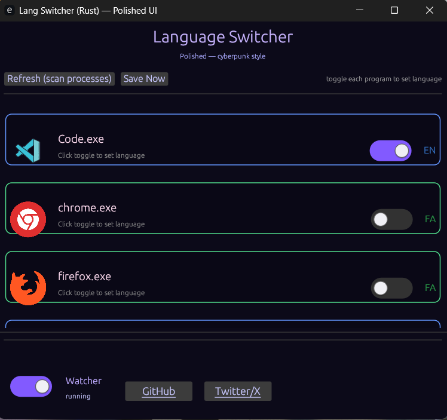
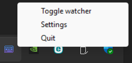

# <p align="center">Language Switcher 🔁</p>

<p align="center">
  
</p>

<p align="center">
  <b>🔄 یک ابزار سبک، سریع و چشم‌نواز برای تغییر سریع زبان برنامه‌ها (EN ↔ FA)</b><br>
  ساخته‌شده با <a href="https://www.rust-lang.org/" target="_blank">Rust</a> — طراحی: Cyberpunk UI
</p>

<p align="center">
  <!-- دکمهٔ دانلود رنگی -->
  <a href="https://github.com/sepy-dev/LangSwitcher/releases" target="_blank" rel="noopener">
    
  </a>
  &nbsp;
  <a href="https://github.com/sepy-dev/LangSwitcher/stargazers" target="_blank" rel="noopener">
    
  </a>
  &nbsp;
  <a href="https://github.com/sepy-dev/LangSwitcher/actions" target="_blank" rel="noopener">
    
  </a>
  &nbsp;
  <a href="https://github.com/sepy-dev/LangSwitcher/blob/main/LICENSE" target="_blank" rel="noopener">
    
  </a>
</p>
🌐 Socials
<p align="center"> <a href="https://github.com/sepy-dev" target="_blank">  </a> <a href="https://x.com/sepy_dev" target="_blank">  </a> <a href="https://www.instagram.com/sepehr.ramzany" target="_blank">  </a> <a href="[https://linkedin.com/in/sepy-dev](https://www.linkedin.com/in/sepehr-ramzani-133043330/)" target="_blank">  </a> </p
---


-

---

## ✨ ویژگی‌ها
<p align="center">
  
  
  
  
</p>

- 🎨 طراحی مدرن و مینیمال با حال و هوای Cyberpunk  
- ⌨️ سوییچ فوری بین **انگلیسی** و **فارسی** (EN ↔ FA) برای برنامه‌های فعال  
- ⚡ تشخیص خودکار برنامه‌های باز برای اعمال سوییچ هوشمند  
- 👀 حالت **Watcher** برای نظارت پس‌زمینه و اعمال خودکار تغییر زبان  
- 💾 ذخیرهٔ تنظیمات به‌صورت پایدار (فایل کانفیگ)  
- 🧩 پوشهٔ `icons/` برای آیکن برنامه‌ها — قابل سفارشی‌سازی

---

## 🖼️ پیش‌نمایش

<p align="center">
  
</p>

---

<p align="center">
  
</p>


---

## 📦 نصب و اجرا (برای کاربران نهایی)

### روش سریع — دانلود از Releases (رنگی و واضح)
1. به صفحهٔ Releases برو:  
     <a href="https://github.com/sepy-dev/LangSwitcher/releases" target="_blank" rel="noopener">
    
  </a>
2.  imstaller رو‌ دانلود کن
3. نصب کن چ سپس با شرتکات اجرا

---

## 🛠️ برای توسعه‌دهندگان

### پیش‌نیازها
- Rust (stable) — [نصب از سایت رسمی](https://www.rust-lang.org/)  
- Cargo (همراه Rust)

### کلون و ساخت
```bash
# کلون کردن ریپو
git clone https://github.com/sepy-dev/LangSwitcher.git
cd LangSwitcher

# ساخت نسخه release
cargo build --release

# باینری خروجی:
# target/release/LanguageSwitcher(.exe)

اجرای محلی (برای دیباگ)

# اجرا با لاگ و حالت توسعه
cargo run

```


LangSwitcher — Quick Project Overview

LangSwitcher is a lightweight and modern tool designed to switch keyboard languages instantly (EN ↔ FA) on Windows. Built with Rust and inspired by Cyberpunk UI, it provides a sleek, minimalistic interface while running efficiently in the background.

Key Features

🎨 Modern Cyberpunk-inspired design

⌨️ Instant language switching between English and Persian

⚡ Automatic detection of running applications

👀 Background Watcher for real-time monitoring

💾 Persistent settings for a seamless experience

Perfect for developers, translators, and power users who need a fast and visually appealing language switcher on Windows
